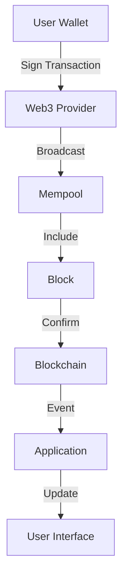

# System Analysis Frameworks

Comprehensive frameworks for analyzing Web3 systems, from architectural assessment to performance optimization.

## 🏗️ Web3 System Architecture Analysis

### 1. Multi-Layer Analysis Framework

#### Layer 1: Infrastructure
- **Blockchain Network**: Node distribution, consensus mechanism, finality
- **Hardware**: Server specifications, network capacity, storage requirements
- **Cloud Services**: Provider reliability, geographic distribution, redundancy

#### Layer 2: Protocol
- **Smart Contracts**: Logic complexity, gas efficiency, upgrade mechanisms
- **Tokenomics**: Supply mechanisms, incentive structures, governance models
- **Interoperability**: Cross-chain bridges, protocol integrations

#### Layer 3: Application
- **User Interface**: Responsiveness, accessibility, user experience
- **Business Logic**: Process flows, data management, error handling
- **Integration Points**: API connections, third-party services, oracles

#### Layer 4: Governance
- **Decision Making**: Voting mechanisms, proposal processes, community engagement
- **Risk Management**: Security policies, incident response, compliance
- **Operations**: Monitoring, maintenance, upgrade procedures

### 2. Performance Analysis Methodology

#### Throughput Analysis
```javascript
// Measure transaction throughput
async function measureThroughput(web3, startBlock, endBlock) {
    const blocks = [];
    for (let i = startBlock; i <= endBlock; i++) {
        const block = await web3.eth.getBlock(i, true);
        blocks.push(block);
    }
    
    const totalTransactions = blocks.reduce((sum, block) => 
        sum + block.transactions.length, 0);
    const timeSpan = blocks[blocks.length - 1].timestamp - blocks[0].timestamp;
    
    return {
        tps: totalTransactions / timeSpan,
        avgBlockTime: timeSpan / blocks.length,
        avgTxPerBlock: totalTransactions / blocks.length
    };
}
```

#### Latency Measurement
```javascript
// Measure RPC call latency
async function measureLatency(web3, iterations = 100) {
    const latencies = [];
    
    for (let i = 0; i < iterations; i++) {
        const start = performance.now();
        await web3.eth.getBlockNumber();
        const end = performance.now();
        latencies.push(end - start);
    }
    
    return {
        average: latencies.reduce((a, b) => a + b, 0) / latencies.length,
        median: latencies.sort()[Math.floor(latencies.length / 2)],
        p95: latencies.sort()[Math.floor(latencies.length * 0.95)]
    };
}
```

## 📊 Data Flow Analysis

### 1. Transaction Flow Mapping


### 2. Smart Contract Interaction Patterns
```solidity
// Analyze contract interaction patterns
contract AnalysisContract {
    event FunctionCall(
        address indexed caller,
        string functionName,
        uint256 gasUsed,
        uint256 timestamp
    );
    
    modifier trackCall(string memory functionName) {
        uint256 initialGas = gasleft();
        _;
        emit FunctionCall(
            msg.sender,
            functionName,
            initialGas - gasleft(),
            block.timestamp
        );
    }
    
    function exampleFunction() external trackCall("exampleFunction") {
        // Function implementation
    }
}
```

## 🔍 Bottleneck Identification

### 1. Gas Usage Analysis
```javascript
// Analyze gas usage patterns
async function analyzeGasUsage(web3, contractAddress, fromBlock) {
    const contract = new web3.eth.Contract(abi, contractAddress);
    
    const events = await contract.getPastEvents('allEvents', {
        fromBlock: fromBlock,
        toBlock: 'latest'
    });
    
    const gasAnalysis = {};
    
    for (const event of events) {
        const tx = await web3.eth.getTransaction(event.transactionHash);
        const receipt = await web3.eth.getTransactionReceipt(event.transactionHash);
        
        const functionName = tx.input.substring(0, 10); // Function selector
        
        if (!gasAnalysis[functionName]) {
            gasAnalysis[functionName] = {
                calls: 0,
                totalGasUsed: 0,
                avgGasUsed: 0,
                maxGasUsed: 0,
                gasEfficiency: 0
            };
        }
        
        gasAnalysis[functionName].calls++;
        gasAnalysis[functionName].totalGasUsed += parseInt(receipt.gasUsed);
        gasAnalysis[functionName].maxGasUsed = Math.max(
            gasAnalysis[functionName].maxGasUsed,
            parseInt(receipt.gasUsed)
        );
        gasAnalysis[functionName].avgGasUsed = 
            gasAnalysis[functionName].totalGasUsed / gasAnalysis[functionName].calls;
        gasAnalysis[functionName].gasEfficiency = 
            parseInt(receipt.gasUsed) / parseInt(tx.gas);
    }
    
    return gasAnalysis;
}
```

### 2. Network Congestion Analysis
```javascript
// Monitor network congestion
async function analyzeNetworkCongestion(web3) {
    const latestBlock = await web3.eth.getBlock('latest', true);
    const pendingTxCount = await web3.eth.getBlockTransactionCount('pending');
    
    // Calculate gas price trends
    const gasPrices = latestBlock.transactions.map(tx => 
        parseInt(tx.gasPrice)
    );
    
    const avgGasPrice = gasPrices.reduce((a, b) => a + b, 0) / gasPrices.length;
    const medianGasPrice = gasPrices.sort()[Math.floor(gasPrices.length / 2)];
    
    return {
        blockUtilization: latestBlock.gasUsed / latestBlock.gasLimit,
        pendingTransactions: pendingTxCount,
        avgGasPrice: web3.utils.fromWei(avgGasPrice.toString(), 'gwei'),
        medianGasPrice: web3.utils.fromWei(medianGasPrice.toString(), 'gwei'),
        congestionLevel: calculateCongestionLevel(latestBlock)
    };
}

function calculateCongestionLevel(block) {
    const utilization = block.gasUsed / block.gasLimit;
    if (utilization > 0.95) return 'Critical';
    if (utilization > 0.85) return 'High';
    if (utilization > 0.70) return 'Medium';
    return 'Low';
}
```

## 🎯 Optimization Strategies

### 1. Smart Contract Optimization
```solidity
// Gas-optimized contract patterns
contract OptimizedContract {
    // Use packed structs to save storage
    struct PackedUser {
        uint128 balance;    // Instead of uint256
        uint64 timestamp;   // Instead of uint256
        uint32 userId;      // Instead of uint256
        bool isActive;      // Packed with above
    }
    
    // Use mappings instead of arrays for lookups
    mapping(address => PackedUser) public users;
    
    // Batch operations to reduce transaction costs
    function batchTransfer(
        address[] calldata recipients,
        uint256[] calldata amounts
    ) external {
        require(recipients.length == amounts.length, "Array length mismatch");
        
        for (uint256 i = 0; i < recipients.length; i++) {
            _transfer(msg.sender, recipients[i], amounts[i]);
        }
    }
    
    // Use unchecked blocks for safe operations (Solidity 0.8+)
    function safeIncrement(uint256 value) internal pure returns (uint256) {
        unchecked {
            return value + 1; // Safe if we know it won't overflow
        }
    }
}
```

### 2. Architecture Optimization
```javascript
// Connection pooling for better performance
class Web3ConnectionPool {
    constructor(endpoints, poolSize = 5) {
        this.endpoints = endpoints;
        this.pools = new Map();
        
        endpoints.forEach(endpoint => {
            this.pools.set(endpoint, {
                connections: [],
                activeConnections: 0,
                maxConnections: poolSize
            });
        });
    }
    
    async getConnection(preferredEndpoint) {
        const pool = this.pools.get(preferredEndpoint);
        
        if (pool.activeConnections < pool.maxConnections) {
            const web3 = new Web3(preferredEndpoint);
            pool.activeConnections++;
            return web3;
        }
        
        // Fallback to least loaded endpoint
        const fallbackEndpoint = this.getLeastLoadedEndpoint();
        return new Web3(fallbackEndpoint);
    }
    
    getLeastLoadedEndpoint() {
        let minLoad = Infinity;
        let bestEndpoint = this.endpoints[0];
        
        for (const [endpoint, pool] of this.pools) {
            if (pool.activeConnections < minLoad) {
                minLoad = pool.activeConnections;
                bestEndpoint = endpoint;
            }
        }
        
        return bestEndpoint;
    }
}
```

## 📈 Performance Monitoring Dashboard

### Key Metrics to Track
1. **Transaction Metrics**
   - Transaction throughput (TPS)
   - Average confirmation time
   - Failed transaction rate
   - Gas price trends

2. **Network Metrics**
   - Node synchronization status
   - Peer connection count
   - Network latency
   - Block propagation time

3. **Application Metrics**
   - API response times
   - Error rates
   - User session duration
   - Feature usage patterns

### Monitoring Implementation
```javascript
// Real-time monitoring setup
class Web3Monitor {
    constructor(web3, metricsEndpoint) {
        this.web3 = web3;
        this.metricsEndpoint = metricsEndpoint;
        this.metrics = {
            blockTime: [],
            gasUsage: [],
            transactionCount: [],
            errors: []
        };
    }
    
    async startMonitoring() {
        setInterval(async () => {
            try {
                await this.collectMetrics();
                await this.sendMetrics();
            } catch (error) {
                this.metrics.errors.push({
                    timestamp: Date.now(),
                    error: error.message
                });
            }
        }, 15000); // Monitor every 15 seconds
    }
    
    async collectMetrics() {
        const latestBlock = await this.web3.eth.getBlock('latest', true);
        const previousBlock = await this.web3.eth.getBlock(latestBlock.number - 1);
        
        const blockTime = latestBlock.timestamp - previousBlock.timestamp;
        const gasUsage = latestBlock.gasUsed / latestBlock.gasLimit;
        
        this.metrics.blockTime.push({
            timestamp: latestBlock.timestamp,
            value: blockTime
        });
        
        this.metrics.gasUsage.push({
            timestamp: latestBlock.timestamp,
            value: gasUsage
        });
        
        this.metrics.transactionCount.push({
            timestamp: latestBlock.timestamp,
            value: latestBlock.transactions.length
        });
    }
}
```

## 🤖 AI-Enhanced Analysis

The Web3 lippytm ChatGPT.AI platform can assist with:
- **Automated pattern recognition** in system behavior
- **Predictive analysis** for performance bottlenecks
- **Optimization recommendations** based on usage patterns
- **Anomaly detection** in system metrics

## 📞 Expert Analysis Support

For complex system analysis or performance optimization challenges, contact our experts at **lippytimemachines@gmail.com**.

---

*Effective system analysis is the foundation of reliable Web3 applications. Monitor, measure, and optimize continuously.*